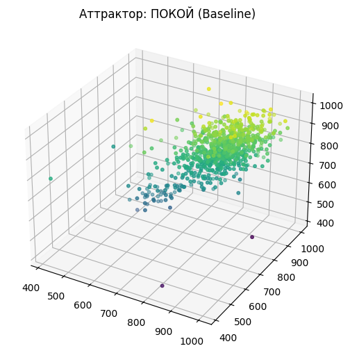
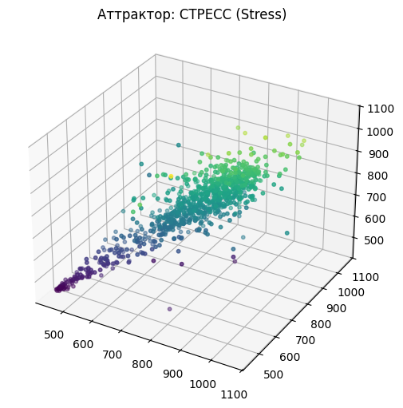

# HRV Stress Detection System 

Программный комплекс для анализа вариабельности сердечного ритма (ВСР) и классификации уровня стресса с использованием методов машинного обучения и нелинейной динамики.

## О проекте
Данный проект разработан в рамках курсовой работы. Он решает задачу автоматической детекции стресса по данным ЭКГ, полученным с носимых устройств.

**Ключевая особенность:** Использование гибридного подхода, сочетающего классические линейные метрики (SDNN, RMSSD) и методы **нелинейной динамики** (реконструкция фазового пространства по теореме Такенса, корреляционная размерность $D_2$).

## Функциональность
*   **Предобработка:** Фильтрация ЭКГ и детекция R-зубцов (библиотека `NeuroKit2`).
*   **Feature Engineering:** Расчет 9 признаков, включая энтропию и размерность аттрактора.
*   **Классификация:** Модель **Gradient Boosting** (точность 95%).
*   **Визуализация:** Построение 3D-аттракторов ритма сердца.

## Структура данных
Проект использует открытый датасет **WESAD** (Wearable Stress and Affect Detection).
> **Внимание:** Сами данные в репозиторий не включены из-за их объема. Вы можете скачать их [здесь](https://www.kaggle.com/datasets/orvile/wesad-wearable-stress-affect-detection-dataset).

## Установка и запуск
Код представлен в формате Jupyter Notebook и оптимизирован для Google Colab.

1.  Клонируйте репозиторий:
    ```bash
    git clone https://github.com/Valerianko/hrv-stress-detection.git
    ```
2.  Установите зависимости:
    ```bash
    pip install -r requirements.txt
    ```
3.  Запустите ноутбук `HRV_Stress_Analysis_Final.ipynb`.

## Результаты
Модель протестирована на независимой выборке субъектов.

| Метрика | Значение |
|---------|----------|
| **Accuracy** | **0.95** |
| **F1-score (Stress)** | **0.91** |
| **ROC AUC** | **1.00** |

**Визуализация аттракторов:**

### Визуализация аттракторов

<table border="0">
  <tr>
    <td align="center">
      
      <br />
      <b>Покой (Baseline)</b><br />
      <i>Сложная, объемная структура ("облако")</i>
    </td>
    <td align="center">
      
      <br />
      <b>Стресс (Stress)</b><br />
      <i>Сжатие аттрактора, потеря сложности</i>
    </td>
  </tr>
</table>

## Стек технологий
*   **Python 3.10**
*   **ML:** Scikit-learn (Gradient Boosting)
*   **DSP:** NeuroKit2, SciPy
*   **Non-linear:** Nolds
