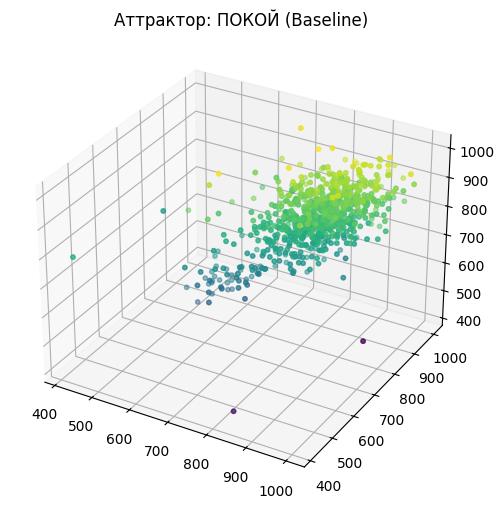
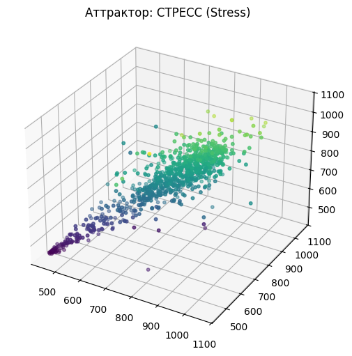

## Данные об авторе

**Крамущенко Валерия Андреевна**  
**Логин:** Kramuxhenko_VA_22   
**Курс / семестр:** 4 курс / 8 семестр  
**Специальность:** «Искусственный интеллект»  
**Вид проекта:** Дипломная работа

# 🫀 Интеллектуальная система мониторинга стресса (HRV Stress Detection System)

Программный комплекс для автоматизированного анализа вариабельности сердечного ритма (ВСР) и диагностики психоэмоционального состояния с использованием методов машинного обучения и нелинейной динамики.  

## О проекте
Система решает задачу детекции стресса по данным ЭКГ в режиме реального времени (Near Real-Time), имитируя работу медицинского дашборда.

В отличие от базовых решений, использующих только линейный анализ, система базируется на гибридном признаковом пространстве, объединяющем классические метрики (SDNN, RMSSD, LF/HF) и методы теории хаоса (реконструкция фазового пространства по теореме Такенса, корреляционная размерность $D_2$). Всего извлекается 8 физиологически обоснованных признаков.

## Ключевые возможности системы
*   **Модульная архитектура:** Полное разделение слоев данных, математического ядра (Inference) и пользовательского интерфейса (UI).
*   **Адаптивный мониторинг (Fast / Full modes):** Поддержка двух режимов работы для балансировки между скоростью отклика и глубиной анализа (отключение тяжелых нелинейных вычислений в Fast-режиме).
*   **Интерпретируемый ИИ (XAI):** Использование SHAP-анализа для объяснения предсказаний модели и доказательства физиологической значимости нелинейных признаков.
*   **Надежная валидация:** Модели обучены и протестированы с использованием кросс-субъектной валидации **Leave-One-Group-Out (LOSO)** для исключения утечек данных.
*   **Интерактивный UI:** Дашборд на базе `Streamlit` с State Machine, 3D-визуализацией аттракторов и отслеживанием трендов (Вероятность / Пульс).

## Архитектура проекта
*   `src/` — Ядро системы (загрузчики данных, пайплайн фильтрации `NeuroKit2`, извлечение признаков, классы моделей).
*   `app/` — Пользовательский интерфейс и логика имитации потоковой передачи данных (`main_ui.py`).
*   `tests/` — Модульное тестирование (Unit tests) с использованием `Pytest`.
*   `reports/` — Автоматически генерируемые отчеты, матрицы ошибок, ROC-кривые и SHAP-графики.

## Функциональность
*   **Предобработка:** Фильтрация ЭКГ и детекция R-зубцов (библиотека `NeuroKit2`).
*   **Feature Engineering:** Расчет 8 признаков, включая энтропию и размерность аттрактора.
*   **Классификация:** Модель **Gradient Boosting** (точность 95%).
*   **Визуализация:** Построение 3D-аттракторов ритма сердца.

## Структура данных
Проект использует открытый датасет **WESAD** (Wearable Stress and Affect Detection).
> **Внимание:** Сами данные в репозиторий не включены из-за их объема. Из-за большого объема исходные .pkl файлы не включены в репозиторий. Вы можете скачать их [здесь](https://www.kaggle.com/datasets/orvile/wesad-wearable-stress-affect-detection-dataset) и поместить в папку data/.

## Установка и запуск
1.  Клонируйте репозиторий и перейдите в папку проекта:
    ```bash
    git clone https://github.com/Valerianko/hrv-stress-detection.git
    cd hrv-stress-detection
    ```
2.  Создайте виртуальное окружение и установите зависимости:
    ```bash
    python -m venv venv
    source venv/Scripts/activate  # Для Windows
    pip install -r requirements.txt
    ```
3.  Запустите пользовательский интерфейс (Дашборд):
    ```bash
    streamlit run app/main_ui.py
    ```

## Результаты (LOSO Cross-Validation)
Модели обучены и протестированы с использованием строгой кросс-субъектной валидации (Leave-One-Group-Out) на 15 независимых субъектах для исключения утечек данных. В качестве основной Production-модели выбран алгоритм SVM (RBF Kernel).

| Метрика | Значение |
|---------|----------|
| **Accuracy** | **0.86** |
| **F1-score (Stress)** | **0.80** |
| **ROC AUC** | **0.92** |
| **PR AUC (Avg. Precision)** | **0.89** |

**Визуализация аттракторов сердечного ритма:**
<table border="0">
  <tr>
    <td align="center">
      
      <br />
      <b>Покой (Baseline)</b><br />
      <i>Сложная, объемная структура ("облако")</i>
    </td>
    <td align="center">
      
      <br />
      <b>Стресс (Stress)</b><br />
      <i>Сжатие аттрактора, потеря сложности</i>
    </td>
  </tr>
</table>

## Стек технологий
*   **Python 3.10, NumPy, Pandas**
*   **Machine Learning:** Scikit-learn, Joblib
*   **Explainability:** SHAP
*   **Signal Processing:** NeuroKit2, SciPy, Nolds (Non-linear Dynamics
*   **Frontend & Visualization:** Streamlit, Plotly, Matplotlib, Seaborn
